# Tinnova

<p align="center">
  
</p>

<p align="center"> 
  Desafio elaborado para teste de conhecimento na empresa <a href="https://tinnova.com.br/" target="__blank">Tinnova</a>.
</p>

<p align="center">
  <a href="#☑️-Requisitos">Requisitos</a>&nbsp;&nbsp;&nbsp;|&nbsp;&nbsp;&nbsp;
  <a href="#⚛️-Configurando o ambiente">Configurando o ambiente</a>&nbsp;&nbsp;&nbsp;|&nbsp;&nbsp;&nbsp;
  <a href="#🧠-Desafios">Desafios</a>&nbsp;&nbsp;&nbsp;

</p>
</br></br>

<p align="center">
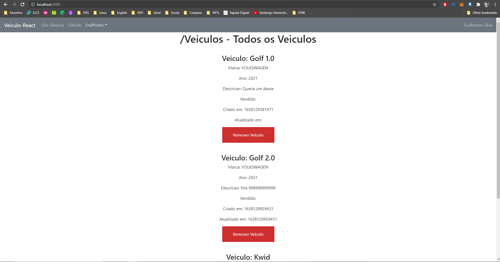
</p>
</br>

## ☑️ Requisitos
- PostgreSql;
- Lombok;
- Spring Tool Suite 4;
</br></br>

## ⚛️ Configurando o ambiente
### 🔶PostgreSql
- Inicie o PgAdmin e crie a database "veiculo".
<p align="center">
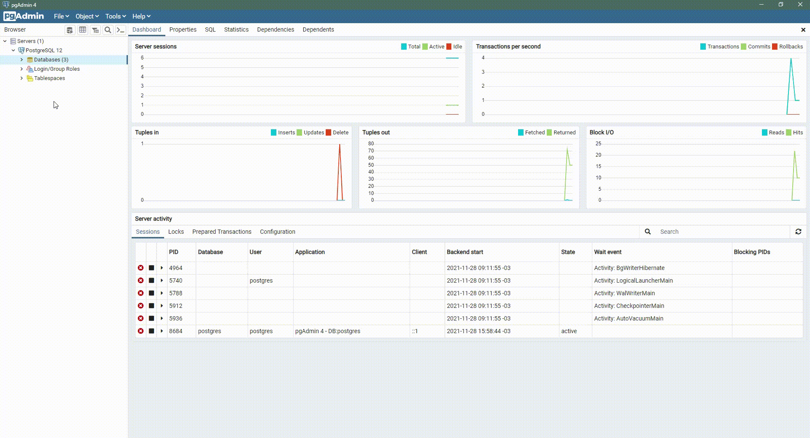
</p>

- Abra o arquivo "application.properties" e configure o username e password conforme definido durante a instalação do postgresql.
<p align="center">
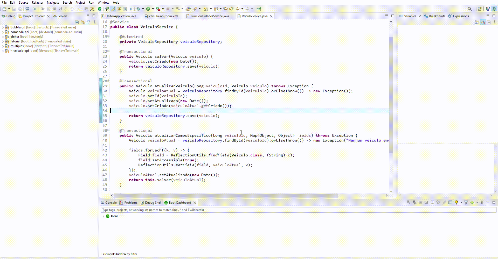
</p>
</br>

### 🔶Lombok
- Com a IDE fechada, abra o arquivo "lombok-1.18.22.jar" localizado por padrão em: "C:/Users/SEU_USUARIO/.m2/repository/org/projectlombok/lombok/1.18.22/lombok-1.18.22.jar" (Windows)
- Caso o launcher do lombok não encontre sua IDE, selecione "Specify location..." e aponte o caminho da mesma.
- Com a IDE selecionada no launcher, selecione a opção "Install/Update".
<p align="center">
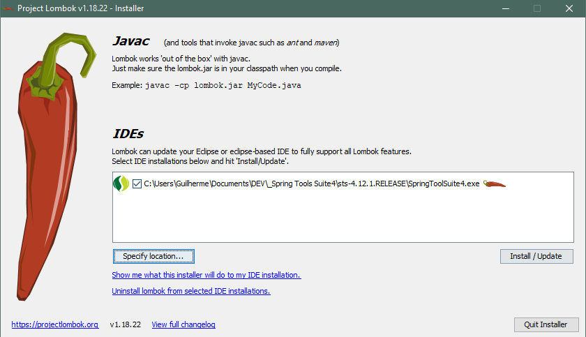
</p>
</br>

- Pronto! Você ja pode iniciar um dos projetos da lista abaixo para realizar a conferencia =)
<p align="center">
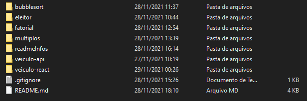
</p>
</br>

### 🔶Configurando o Veiculo-React (FrontEnd)
- Abra o projeto "veiculo-react" no VS Code e rode os seguintes comandos:
```bash
### Instalar as dependências
$ npm install

###Instalar o módulo para manipular rotas
$ npm install --save react-router-dom

### Rodar o projeto (Necessario estar com a API rodando)
$ npm start
```
</br>


## 🧠 Desafios
- 🔶Exercicio 1 - Eleitor
<p align="center">
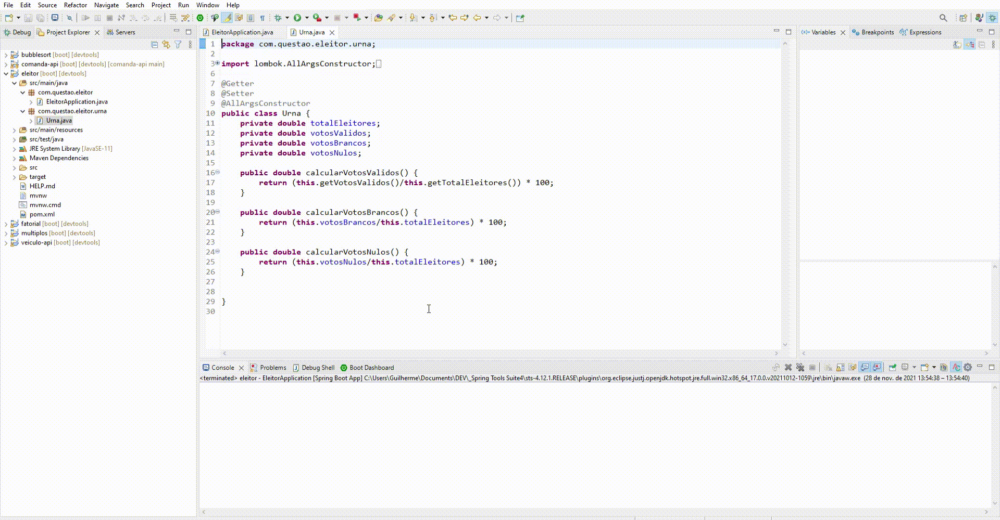
</p>
</br>

- 🔶Exercicio 2 - Bubblesort
<p align="center">
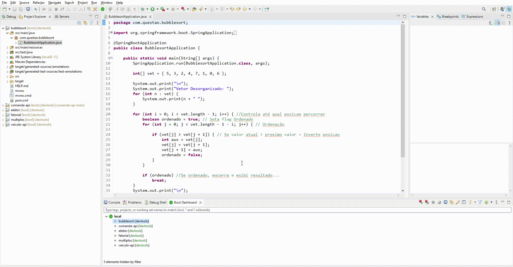
</p>
</br>

- 🔶Exercicio 3 - Fatorial
<p align="center">
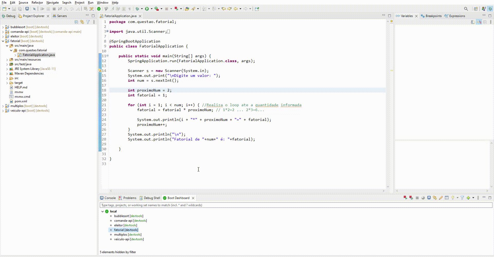
</p>
</br>

- 🔶Exercicio 4 - Multiplos
<p align="center">
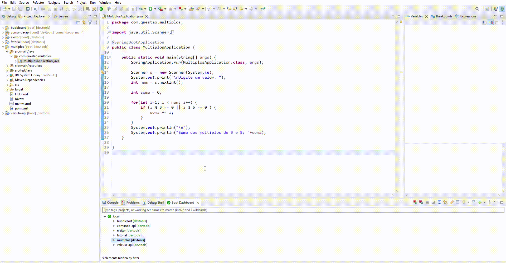
</p>
</br>

## 🔶Exercicio 5 - Veiculo API (Backend)
- POST (Adicionar Veiculo)
<p align="center">
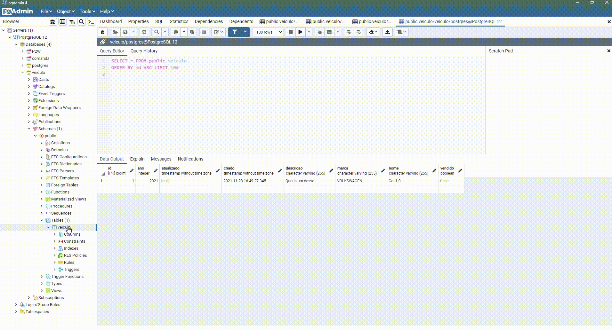
</p>
</br>

- PUT (Atualizar Veiculo)
<p align="center">

</p>
</br>

- PATCH (Atualizar determinado campo do Veiculo)
<p align="center">
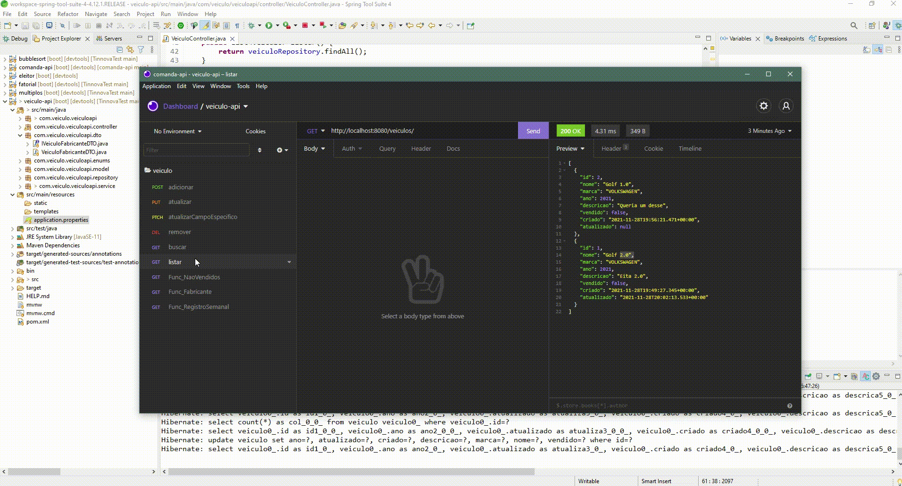
</p>
</br>

- GET (Listar todos os Veiculos)
<p align="center">
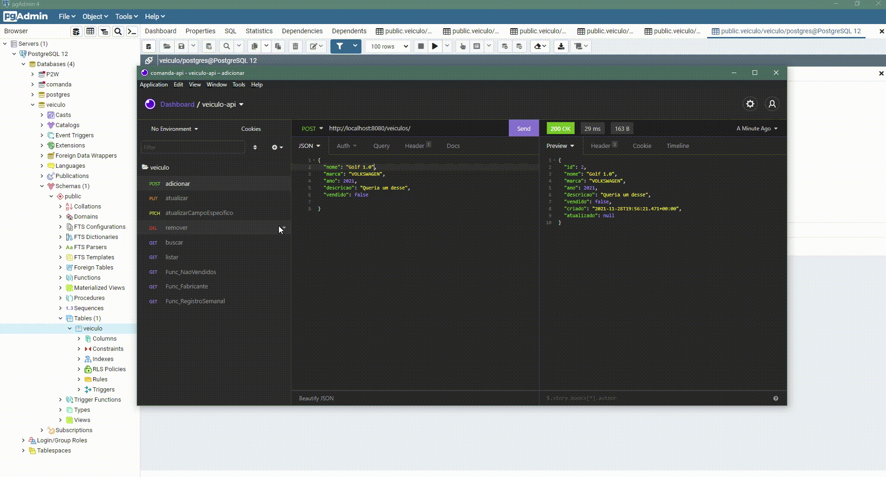
</p>
</br>

- GET (Buscar um Veiculo especifico)
<p align="center">
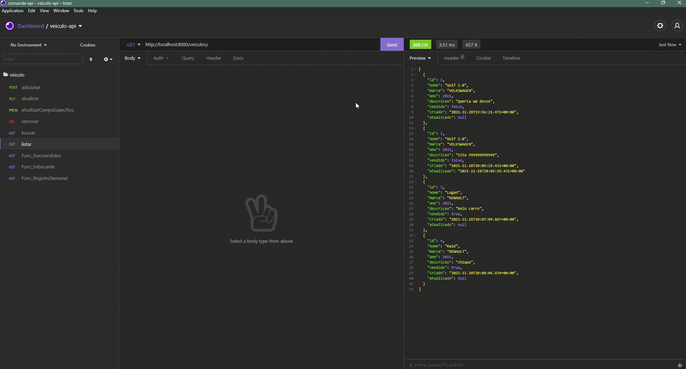
</p>
</br>

- DELETE (Remover um Veiculo especifico)
<p align="center">
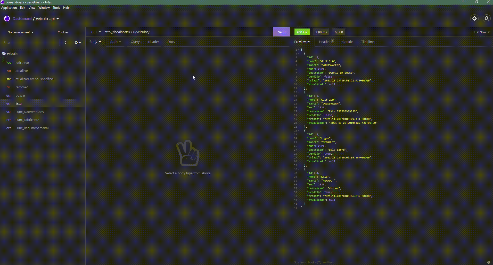
</p>
</br>

- GET (Listar apenas os Veiculos NÃO vendidos)
<p align="center">
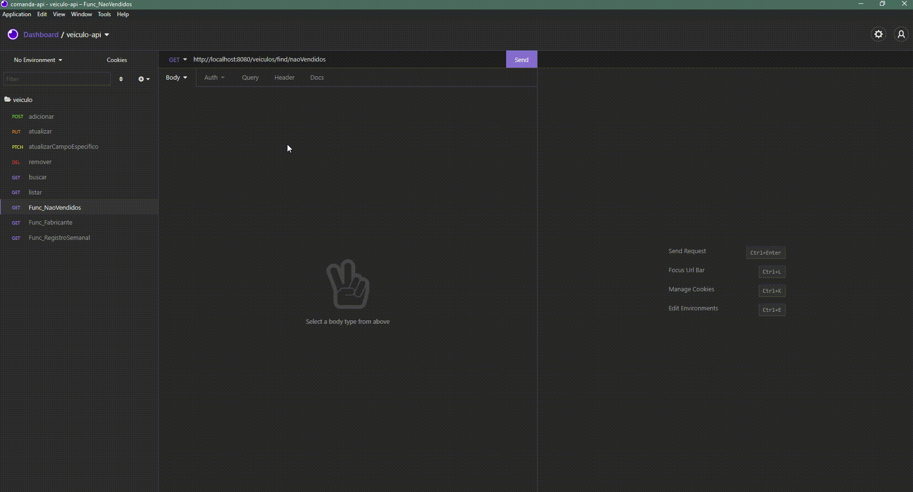
</p>
</br>

- GET (Listar os veiculos agrupando por marcas e quantidade)
<p align="center">
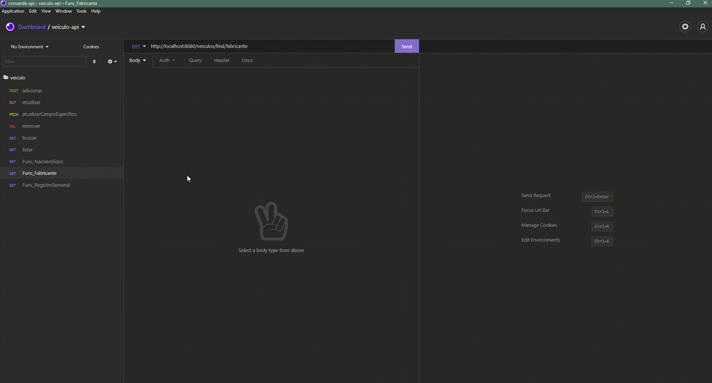
</p>
</br>

- GET (Listar os veiculos registrados nos ultimos 7 dias)
<p align="center">
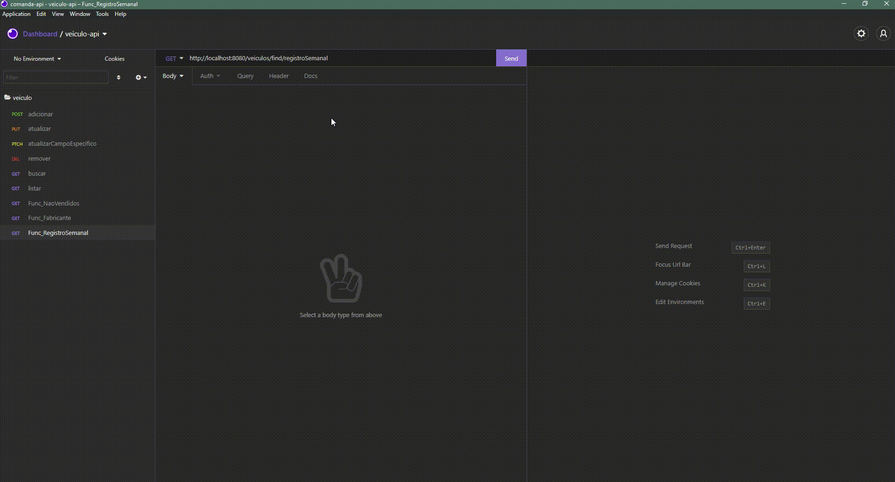
</p>

<p align="center">

</p>

 ###### Recebido em: 27/11/2021 09:47 - Ultima atualização: 29/11/2021 08:31

---

Criado por 💟 by [Guilherme Silva.](https://github.com/guilhermehenrysilva) 
